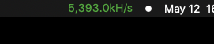
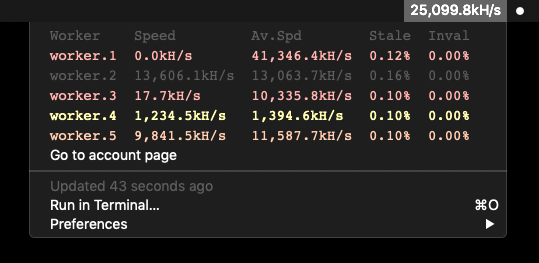

# LitecoinPool Monitor for BitBar
This script plugin provides 'at-a-glance' monitoring of your LitecoinPool workers directly from the MacOS menu bar. It displays up-to-the minute hash rates for your account, as well as rates, averages, and percentage stats for each worker by leveraging LitecoinPool.org's JSON API. Optional color-coding makes identifying problems with workers visually simple, and alerts to issues quickly.

By default, the script updates every 5 minutes, but can be [adjusted](https://github.com/matryer/bitbar#configure-the-refresh-time) to your preference (just keep server request etiquette in mind).

## Screenshots
LitecoinPool Monitor current speed in the MacOS Menu Bar:



Drop-down menu showing worker status:



## Related
If you prefer to monitor your workers from the Notification Center, check out [https://github.com/jstnryan/litecoinpool-monitor-todayscripts](https://github.com/jstnryan/litecoinpool-monitor-todayscripts)

## BitBar
[BitBar](https://getbitbar.com/) is an extensible application which allows the output of shell scripts to be displayed from the MacOS menu bar. [BitBar on GitHub](https://github.com/matryer/bitbar)

## Setup & Usage
1. Install [BitBar](https://github.com/matryer/bitbar#get-started)
   ````
   brew cask install bitbar
   ````
1. Copy the [litecoinpool-monitor.5m.php](litecoinpool-monitor.5m.php) file to your BitBar plugins folder
1. Edit `litecoinpool-monitor.php` with your favorite text editor; modify the settings shown below to your preference:
   ````php
   // SETTINGS: Enter your LitecoinPool API Key between the quotes below
   // You can find your API key on your LitecoinPool.org account page:
   //  https://www.litecoinpool.org/account
   $apiKey = 'ENTER_YOUR_API_KEY_HERE';

   // Low hash rate threshold (percent); if a worker falls below these thresholds
   // (current vs 24 average) a corresponding warning level will be triggered
   $lowRate = [
       'low' => 10,
       'medium' => 15,
       'high' => 20,
   ];

   // The lowest alert level color to show in the menu bar text; until this level
   // is reached, the menu bar text will be the system default (ex: black or white)
   //
   // 4 = disable color (always system color)
   // 3 = only show high (red)
   // 2 = show medium (orange) and greater
   // 1 = show low (yellow) and greater
   // 0 = show all (green when no alert)
   $menuBarMinAlert = 0;
   ````
1. Start BitBar

## Dependencies
Aside from BitBar, this script uses PHP (CLI) with cURL; both are on nearly every modern Mac.

## License
This script is released under the [WTFPL](http://www.wtfpl.net/).

Copyright 2019 Justin Ryan <jstn@jstnryan.com>
This work is free. You can redistribute it and/or modify it under the
terms of the Do What The Fuck You Want To Public License, Version 2,
as published by Sam Hocevar. See the LICENSE.txt file for more details.